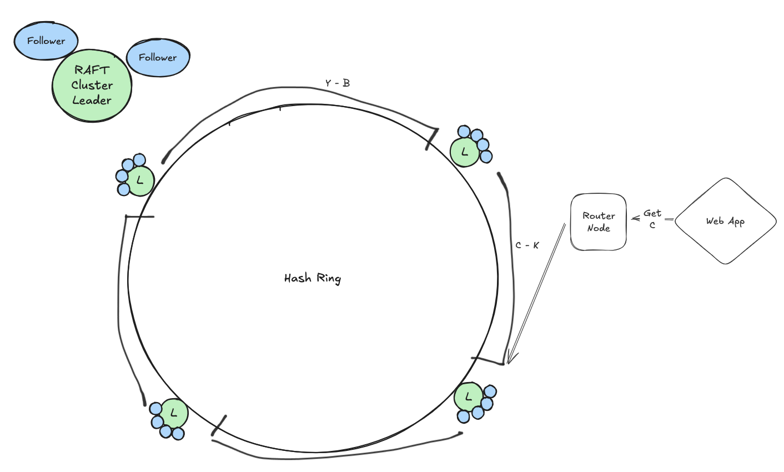

# RAFT Course
This was a course taken with coworkers and peers to strengthen our software design, testing, and architecture skills while also learning about distributed systems

[The course](https://www.dabeaz.com/raft.html) was headed by David Beazley, and anyone interested should reach out to him for work groups or solo trip!

## Goal
The goal of the course was to create a working implementation of [the raft paper](https://raft.github.io/), and then to use it to create a strongly consistent replicated K-V Store powering a web app

### Use Cases
The use cases in the wild today are mostly for configuration K-V stores like etcd, DNS, or other systems which require strong consistency over availability 

#### Partitioned K-V Store
The setup below depicts a hypothetical structure of a web app powered by a partitioned, distributed, strongly consistent (not necessarily always available) K-V Store

### Implementation
The majority of the focus was on creating a configurable RAFT cluster that could be wrapped into a Docker image and deployed on a private network. This cluster should have a bootstrapped leader node, and then after that become a self healing cluster with strong consistency. 

#### DNS
At this point we use hardcoded `localhost` values with ports for our nodes for testing, and hardcoded IP addresses for deployment on a private cloud network

#### Autoscaling
Our RAFT cluster does not autoscale, and sits with 2 or 4 replicas, meaning 3 or 5 nodes altogether, for our K-V store
